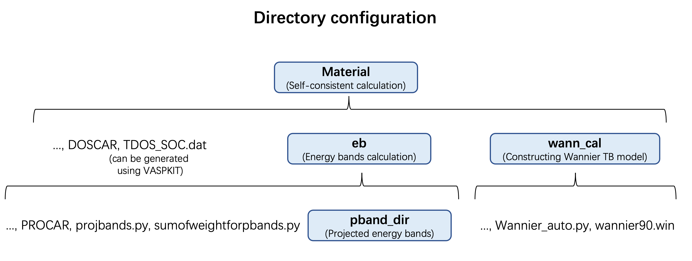

Automatically generate input files for Wannier90 software to construct Wannier tight-binding models; Generate projected electronic band structures from the PROCAR file; Plot projected density of states.

If you use our code for your research, please cite: https://doi.org/10.48550/arXiv.2506.03871

Code list:
Wannier_auto.py  自动生成合适的Wannier90软件的输入文件"wannier90.win"
wannier90.win  Wannier90软件的输入文件模板
projbands.py  自动生成投影能带结构数据，并存放于pband_dir目录下
sumofweightforpbands.py  计算投影能带权重，并生成图片方便用户直观了解投影能带权重分布以及对应的能带指标范围

建议目录架构：
如果按照此目录架构部署，所有.py程序可直接运行，否则需要更改.py中的文件路径

